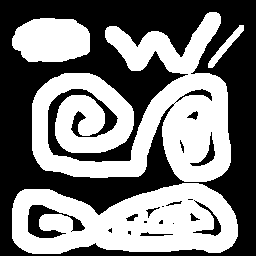
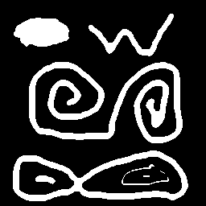
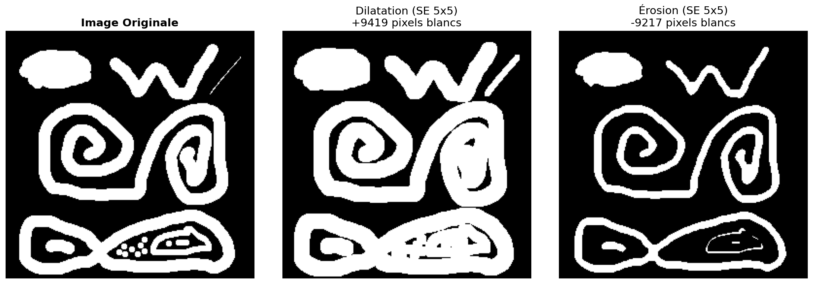
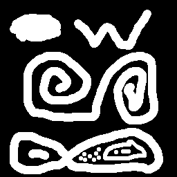
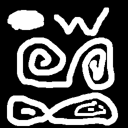
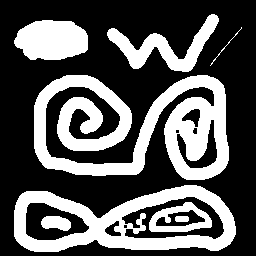
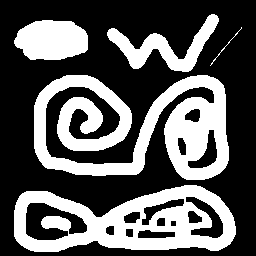
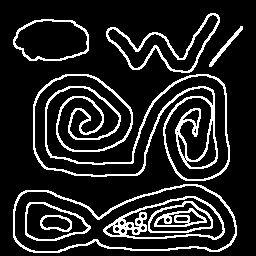
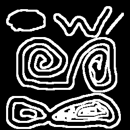

# Compte Rendu TP5 - Morphologie Mathématique

**Réalisé par :** Aya Chihoub  
**Module :** Analyse d'Image  
**Dépôt GitHub :** https://github.com/Aya-chihoub/TP5-Morphologie-Mathematique

---

## État d'Avancement

| Exercice | Description | Statut |
|----------|-------------|--------|
| Exercice 1 | Dilatation | Terminé ✓ |
| Exercice 2 | Érosion | Terminé ✓ |
| Exercice 3 | Ouverture | Terminé ✓ |
| Exercice 4 | Fermeture | Terminé ✓ |
| Exercice 5 | Gradient Morphologique | Terminé ✓ |

**Tous les exercices ont été implémentés et testés avec succès.**

---

## 1. Dilatation

### Principe
La dilatation est une opération morphologique fondamentale qui **agrandit les objets blancs** dans une image binaire. Pour chaque pixel, on examine tous les pixels voisins définis par l'élément structurant et on prend la **valeur maximale**. 

Concrètement, si au moins un pixel blanc se trouve sous l'élément structurant, le pixel central devient blanc. Cela a pour effet d'étendre les régions blanches et de combler les petits trous noirs.

### Implémentation
```python
def dilate(image, structuring_element):
    for y in range(height):
        for x in range(width):
            max_val = 0.0
            for each pixel under SE:
                max_val = max(max_val, image[pixel])
            result[y, x] = max_val
    return result
```

### Résultats

| SE 3×3 | SE 5×5 |
|--------|--------|
|  |  |

**Observation :** Plus l'élément structurant est grand, plus l'agrandissement des objets est important. Avec un SE 5×5, les objets sont nettement plus épais qu'avec un SE 3×3.

---

## 2. Érosion

### Principe
L'érosion est l'opération **duale** de la dilatation. Elle **réduit les objets blancs** en prenant la **valeur minimale** sous l'élément structurant. 

Pour qu'un pixel reste blanc, **tous** les pixels sous l'élément structurant doivent être blancs. Sinon, le pixel devient noir. Cela a pour effet de rétrécir les objets et de supprimer les petites structures isolées.

### Propriété de Dualité
Une propriété importante est que l'érosion peut s'exprimer en fonction de la dilatation :
- Éroder une image = Inverser l'image → Dilater → Inverser le résultat

Cette propriété permet d'implémenter l'érosion en **une seule ligne de code**.

### Implémentation
```python
def erode(image, structuring_element):
    # Utilisation de la dualité
    return 1.0 - dilate(1.0 - image, structuring_element)
```

### Résultats

| SE 3×3 | SE 5×5 |
|--------|--------|
|  |  |

**Observation :** L'érosion réduit la taille des objets. Les petites structures disparaissent complètement, et les objets fins peuvent être coupés.

---

## 3. Comparaison Dilatation / Érosion



Cette comparaison montre clairement les effets opposés des deux opérations :
- **Dilatation** : Les objets grossissent, les trous se remplissent
- **Érosion** : Les objets rétrécissent, les détails fins disparaissent

---

## 4. Ouverture

### Principe
L'ouverture est une **composition** de l'érosion suivie de la dilatation. Elle permet de **supprimer les petits éléments** (plus petits que l'élément structurant) tout en préservant la forme générale des objets plus grands.

L'érosion supprime d'abord les petites structures, puis la dilatation restaure approximativement la taille des objets restants.

### Implémentation
```python
def open_morphology(image, structuring_element):
    # Ouverture = Dilatation(Érosion(Image))
    return dilate(erode(image, structuring_element), structuring_element)
```

### Résultats

| SE 3×3 | SE 5×5 |
|--------|--------|
|  |  |

**Observation :** L'ouverture élimine les petites protubérances et les objets isolés plus petits que l'élément structurant. Les objets principaux conservent leur forme générale.

---

## 5. Fermeture

### Principe
La fermeture est l'opération **duale** de l'ouverture : c'est une dilatation suivie d'une érosion. Elle permet de **boucher les petits trous** et de **connecter les objets proches**.

La dilatation comble d'abord les trous et connecte les objets, puis l'érosion restaure la taille des objets.

### Implémentation
```python
def close_morphology(image, structuring_element):
    # Fermeture = Érosion(Dilatation(Image))
    return erode(dilate(image, structuring_element), structuring_element)
```

### Résultats

| SE 3×3 | SE 5×5 |
|--------|--------|
|  |  |

**Observation :** La fermeture remplit les petits trous à l'intérieur des objets et peut fusionner des objets très proches. La forme extérieure des objets est largement préservée.

---

## 6. Gradient Morphologique

### Principe
Le gradient morphologique est un outil de **détection de contours**. Il calcule la différence entre la dilatation et l'érosion d'une image, ce qui met en évidence les zones de transition entre les régions blanches et noires.

- **Gradient interne** : Image - Érosion (contours à l'intérieur)
- **Gradient externe** : Dilatation - Image (contours à l'extérieur)
- **Gradient complet** : Dilatation - Érosion (combinaison des deux)

### Implémentation
```python
def morphological_gradient(image, structuring_element):
    # Gradient = Dilatation - Érosion
    return dilate(image, structuring_element) - erode(image, structuring_element)
```

### Résultats

| SE 3×3 | SE 5×5 |
|--------|--------|
|  |  |

**Observation :** Le gradient morphologique produit une image des contours. L'épaisseur des contours dépend de la taille de l'élément structurant : un SE plus grand donne des contours plus épais.

---

## Récapitulatif

| Opération | SE 3×3 | SE 5×5 |
|-----------|--------|--------|
| **Dilatation** |  |  |
| **Érosion** |  |  |
| **Ouverture** |  |  |
| **Fermeture** |  |  |
| **Gradient** |  |  |

---

## Conclusion

Ce TP a permis d'implémenter et de comprendre les cinq opérations fondamentales de la morphologie mathématique. Les points clés à retenir sont :

1. **Dilatation et Érosion** sont les opérations de base, utilisant respectivement le maximum et le minimum local
2. La **dualité** entre ces opérations permet des implémentations élégantes
3. **Ouverture et Fermeture** sont des compositions qui préservent mieux la forme des objets
4. Le **Gradient morphologique** est un outil efficace de détection de contours
5. La **taille de l'élément structurant** contrôle l'échelle des transformations
